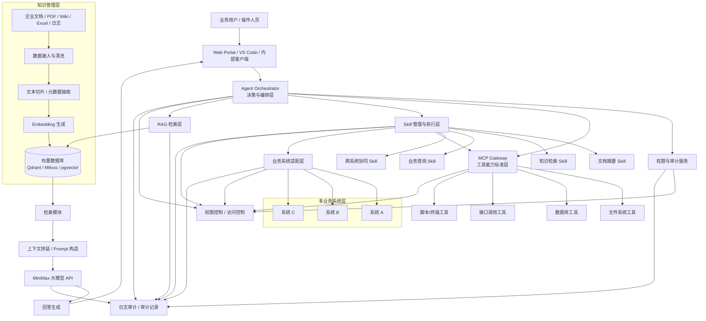

# AI 平台整体文档

## 1. 文档目的

本文件是 AI 平台的整合型文档，覆盖平台架构、功能模块、Skill 机制、权限体系、业务系统接入、接口规范、监控与运维等内容，便于开发、测试和运维团队统一理解与落地。

---

## 2. 平台概览

AI 平台由以下核心能力构成：

- MCP 工具层：统一暴露本地能力与业务接口
- Skill 层：可配置、可组合的领域能力
- 多业务系统适配层：统一接入企业业务系统并支持跨系统协同
- RAG 知识层：文档接入、文本切片、Embedding、向量检索
- 生成层：MiniMax 大模型生成答案
- 权限与审计层：MCP 工具级权限、Skill 级权限、日志审计
- 运维层：监控、告警、部署、备份

---

## 3. AI 平台核心功能

### 3.1 文档与知识管理

- 支持 PDF/Markdown/TXT/Word/Excel/HTML 等文档接入
- 文本提取、清洗、分块、元数据标注
- Embedding 向量化并写入向量数据库
- 向量检索与来源追溯

### 3.2 RAG 问答能力

- 用户自然语言问题输入
- 相似度检索返回相关文档片段
- 上下文拼装并调用 MiniMax API 生成回答
- 支持多轮对话与会话上下文管理

### 3.3 MCP 工具能力

- 统一注册、调用本地能力接口
- 支持文件系统、数据库查询、HTTP 接口、脚本/终端工具
- 保障工具调用过程可审计、可控制

### 3.4 Skill 能力管理

- Skill 注册、配置与版本管理
- Skill 输入/输出 schema 定义
- Skill 权限管理
- Skill 与 MCP/业务系统的执行映射
- Skill 组合与编排

### 3.5 多业务系统接入

- 业务系统注册与配置
- 统一适配器调用模型
- 跨系统调用、结果聚合
- 系统级异常处理与重试

### 3.6 权限与审计

- 用户认证与角色管理
- MCP 工具级权限校验
- Skill 级权限校验
- 权限审计与越权记录
- 黑白名单机制

### 3.7 监控与运维

- 结构化日志与审计日志
- Prometheus/Grafana 监控指标
- 告警规则与告警通知
- 运行健康检查
- 部署与备份策略

---

## 4. 平台架构图



---

## 5. 项目目录建议

```text
mcp_rag_minimax/
├── app/
│   ├── api/
│   │   ├── main.py
│   │   └── routers/
│   │       ├── chat.py
│   │       ├── mcp.py
│   │       ├── skills.py
│   │       └── systems.py
│   ├── agent/
│   │   ├── orchestrator.py
│   │   ├── planner.py
│   │   └── tools.py
│   ├── auth/
│   │   ├── auth.py
│   │   ├── permissions.py
│   │   └── models.py
│   ├── rag/
│   │   ├── embedder.py
│   │   ├── retriever.py
│   │   ├── prompt_builder.py
│   │   └── pipeline.py
│   ├── mcp/
│   │   ├── server.py
│   │   ├── tools/
│   │   │   ├── filesystem.py
│   │   │   ├── database.py
│   │   │   └── api_call.py
│   │   └── schemas.py
│   ├── skills/
│   │   ├── registry.py
│   │   ├── executor.py
│   │   ├── schemas.py
│   │   └── examples/
│   │       ├── summarize.py
│   │       └── search_docs.py
│   └── systems/
│       ├── registry.py
│       ├── adapter.py
│       └── configs/
│           ├── system_a.yaml
│           ├── system_b.yaml
│           └── system_c.yaml
├── config/
├── data/
│   ├── raw/
│   ├── processed/
│   └── vectors/
├── logs/
├── tests/
├── docker/
├── scripts/
├── requirements.txt
└── README.md
```

---

## 6. 权限体系补充

### 6.1 权限模型

建议采用 RBAC 为主、ABAC 为辅。

- RBAC：角色与权限直接映射，适用于 MCP 工具与 Skill 的静态授权
- ABAC：根据上下文属性（客户端 IP、用户标签、文档分类）进行细粒度控制

### 6.2 权限数据结构

- roles(id, name, description)
- permissions(id, name, action, resource_type)
- role_permissions(role_id, permission_id)
- user_roles(user_id, role_id)
- policies(id, name, condition_expr, effect)
- permission_audit(id, user_id, action, object_type, object_id, result, reason, timestamp)

### 6.3 权限流程

1. 用户请求进入 API
2. Agent/PEP 调用权限服务（PDP）校验
3. PDP 返回 allow/deny
4. 若 deny 则拒绝执行并记录审计

---

## 7. Skill 规范补充

### 7.1 Skill 定义示例

```yaml
name: search_docs
version: "1.0"
description: "在企业向量库中检索相关文档并返回摘要"
inputs:
  - name: query
    type: string
    required: true
  - name: top_k
    type: integer
    required: false
    default: 5
outputs:
  - name: results
    type: array
    items: object
permissions:
  - name: skill.search_docs.execute
mappings:
  - step: retrieve
    type: retriever
    config:
      top_k: ${inputs.top_k}
  - step: summarize
    type: summarizer
    config:
      length: 200
```

### 7.2 Skill 扩展与组合

- 支持 Skill 依赖声明（depends_on）
- 支持 Skill 版本管理
- 支持 Skill 热重载

---

## 8. 业务系统适配补充

### 8.1 配置模板示例

```yaml
system_name: system_a
type: http
base_url: https://api.systema.example.com
auth:
  method: oauth2
  token_url: https://auth.example.com/token
  client_id: ${CLIENT_ID}
  client_secret: ${CLIENT_SECRET}
endpoints:
  - name: query_user
    path: /api/v1/users/{user_id}
    method: GET
    timeout: 5
    retries: 2
    response_map: |
      return {"id": resp.get('id'), "name": resp.get('displayName')}
```

### 8.2 适配器实现要点

- 统一认证逻辑
- 请求构建与参数映射
- 响应解析与标准化
- 错误处理与重试

---

## 9. API 示例补充

### 9.1 业务问答接口

请求：

```json
{
  "message": "请帮我查找合同相关条款并总结",
  "session_id": "sess-123",
  "use_skill": "search_docs",
  "context": {"user_id": "u-100"}
}
```

响应：

```json
{
  "answer": "摘要内容...",
  "sources": ["doc:contract_2023#chunk_12"],
  "skill_results": [{"name":"search_docs","results":[{"doc_id":"doc1","score":0.92,"snippet":"..."}]}],
  "trace_id": "trace-abc-123"
}
```

### 9.2 Skill 执行接口

请求：

```json
{ "query": "合同 交付 条款", "top_k": 5 }
```

响应：

```json
{ "results": [ {"doc_id":"doc1","score":0.92,"snippet":"..."} ] }
```

---

## 10. 监控与告警补充

### 10.1 建议指标

- http_requests_total
- http_request_duration_seconds
- skill_execution_duration_seconds
- vector_db_query_duration_seconds
- api_error_rate
- permission_check_failures_total

### 10.2 推荐方案

- Prometheus + Grafana
- Alertmanager 进行告警
- Loki/Elasticsearch 用于日志检索

### 10.3 告警规则示例

- API 错误率 > 5% 持续 5 分钟
- 向量库连接失败
- Skill 执行失败率 > 2%

---

## 11. 部署与运维补充

### 11.1 本地开发

- 使用 Docker Compose 运行 API、Qdrant、Redis、可选 ELK/Loki
- 提供 `/health` 健康检查接口

### 11.2 生产部署

- 建议使用 Kubernetes 部署 API 服务与向量数据库
- 向量数据库使用 StatefulSet 并挂载持久化卷
- 使用 Ingress 或 API Gateway 做 TLS 与认证

### 11.3 备份与恢复

- 定期快照向量数据
- 定期备份文档元数据与索引映射
- 支持恢复流程与演练

---

## 12. 缺失项定位与后续补充

当前仍需完善：

- 详细权限模型（RBAC/ABAC）实现与策略语法
- Skill 元数据与运行时配置系统
- 业务系统适配器的具体实现模板
- 生产运维脚本与灾备流程
- 更完整的接口文档与错误码规范

---

## 13. 推荐落地顺序

1. 搭建项目骨架与基础服务
2. 实现文档接入与向量检索
3. 实现 RAG 问答与 MiniMax 生成
4. 实现 MCP 工具层与 Skill 基础能力
5. 实现多业务系统接入与跨系统协同
6. 补齐权限与审计体系
7. 实现监控/告警与部署方案

---

## 14. 参考文件

- `mcp_rag_minimax_architecture.md`
- `mcp_rag_minimax_requirements.md`
- `mcp_rag_minimax_technical_design.md`
- `mcp_rag_minimax_development_tasks.md`
- `permissions_model.md`
- `skill_spec.md`
- `system_adapter_template.md`
- `monitoring_deployment.md`
